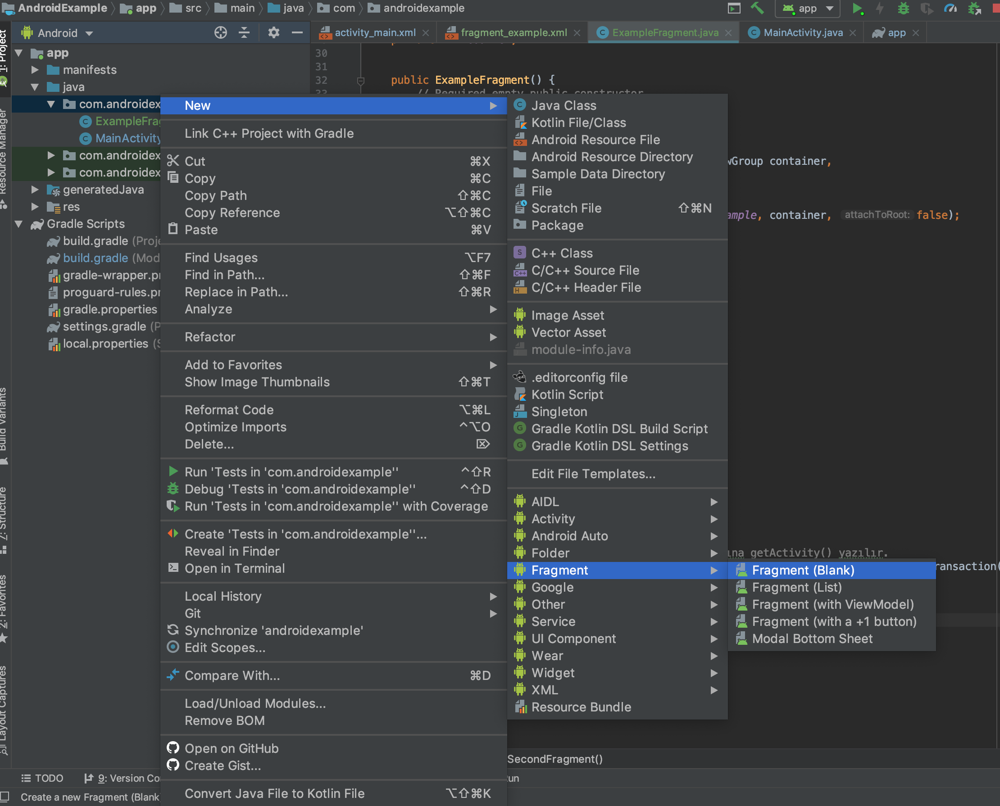
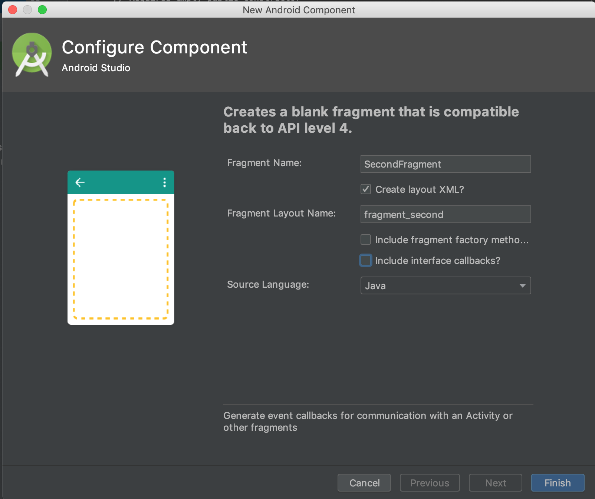

# **Android Example for Fragments and ButterKnife**


## *Fragment Nasıl Açılır?*







As Kanye West said:

> We're living the future so
> the present is our past.

```
@Override
public View onCreateView(LayoutInflater inflater, ViewGroup container,
                             Bundle savedInstanceState) {
    // Inflate the layout for this fragment
    return inflater.inflate(R.layout.fragment_second, container, false);
}
```

      
      
First Header | Second Header
------------ | -------------
Content from cell 1 | Content from cell 2
Content in the first column | Content in the second column